<div align="center">



**Self-hosted, browser-based remote access for Raspberry Pis, Linux boxes, and anything else behind NAT.**

[](https://github.com/jaypetez/legendary-umbrella/actions/workflows/ci.yml)
[](https://go.dev/)
[](./LICENSE)
[](https://webrtc.org/)

</div>

---

## What it is

Connect gives you a browser **terminal** (and, soon, a browser **remote desktop**) to devices sitting behind NAT. No port forwarding, no VPN, no inbound firewall holes — the device dials out to a signaling service you host, and your browser reaches it over a peer‑to‑peer WebRTC data channel. When a peer can't hole‑punch, traffic falls back to your own TURN relay, still end‑to‑end encrypted with DTLS‑SRTP so even the relay operator can't read session bytes.

Think of it as a self‑hosted, open‑source shape of [Raspberry Pi Connect](https://www.raspberrypi.com/documentation/services/connect.html): same user experience, but the signaling service, the TURN relay, the device registry, and the keys are all yours.

## Why

Because "make it easy to SSH into my Pi from the web, without opening port 22 to the internet" is a problem that keeps getting solved by someone else's SaaS, with someone else's keys, on someone else's roadmap. This one is small enough for one person to operate and boring enough to trust.

## Status

This is an early‑stage greenfield Go project. The control plane and browser shell are usable today; the remote desktop path is the next big chunk of work.

| Milestone | Status | What ships |
|:---|:---:|:---|
| **M0** — Signaling + device‑code enrollment | ✅ | SQLite registry, presence WS, RFC 8628 flow, embedded browser UI |
| **M1** — Browser shell | ✅ | xterm.js + WebRTC DataChannel + PTY; cross‑platform agent |
| **M2** — Shell on Windows / macOS | 🟡 | Windows ConPTY works today; macOS cross‑compiles, untested |
| **M3** — Linux screen share | ⏳ | PipeWire portal → GStreamer H.264 → Pion video track |
| **M4** — coturn relay | ⏳ | Ephemeral creds via RFC 7635 REST API |
| **M5** — Windows screen share | ⏳ | Windows.Graphics.Capture + Media Foundation |
| **M6** — macOS screen share | ⏳ | ScreenCaptureKit + VideoToolbox |

## Architecture at a glance

```
                            ┌──────────────────────────┐
                            │  Signaling + enrollment  │
                            │  (Go HTTP/WebSocket)     │
                            └────────────┬─────────────┘
                                         │ control plane only
                       ┌─────────────────┴────────────────┐
              ┌────────▼──────────┐               ┌───────▼──────────┐
              │  Device agent     │◄──WebRTC────► │  Browser client  │
              │  (Go + Pion)      │   P2P / TURN  │  (xterm.js +     │
              │  cross‑platform   │               │   <video> tag)   │
              └───────────────────┘               └──────────────────┘
                         ▲
                         │ fallback media path
                  ┌──────┴───────┐
                  │  coturn      │
                  │  (TURN/STUN) │
                  └──────────────┘
```

Signaling is **never in the media path**. It just matches peers, mints short‑lived TURN credentials, and relays SDP/ICE until a PeerConnection is up. Once connected, session bytes stream directly between agent and browser.

## Quick start

```bash
# Build everything
go build ./...

# Terminal 1 — signaling service (creates data/signaling.db, serves browser bundle)
./signaling -addr :8080

# Terminal 2 — enroll the agent
./agent enroll --server http://localhost:8080
# Prints a user code. Open http://localhost:8080/enroll and approve it.

# Terminal 3 — run the agent
./agent run

# Browser: open http://localhost:8080 and click Shell next to the device.
```

### Cross‑compile an agent for a real device

```bash
GOOS=linux   GOARCH=arm64 go build -o bin/agent-linux-arm64  ./cmd/agent   # Pi 5 etc.
GOOS=linux   GOARCH=amd64 go build -o bin/agent-linux-amd64  ./cmd/agent
GOOS=darwin  GOARCH=arm64 go build -o bin/agent-darwin-arm64 ./cmd/agent   # Apple silicon
GOOS=windows GOARCH=amd64 go build -o bin/agent-windows.exe  ./cmd/agent
```

The whole stack is pure Go — modernc.org/sqlite, coder/websocket, Pion — so cross‑compilation works without CGO toolchains.

## Development

```bash
go vet ./...          # static checks
go test ./...         # unit tests
scripts/smoke.sh      # end‑to‑end on Linux: enrol → run → shelltest (command round‑trip)
```

On every push and PR, CI runs:

- **Lint & format** — `go vet`, `gofmt -l`, `go mod tidy` diff check
- **Unit tests** — `go test -race ./...`
- **Cross‑compile matrix** — linux/amd64, linux/arm64, darwin/amd64, darwin/arm64, windows/amd64
- **Smoke test (Linux)** — `scripts/smoke.sh` asserts a command round‑trips through a real WebRTC DataChannel + PTY

See [`.github/workflows/ci.yml`](.github/workflows/ci.yml).

## Repository layout

```
cmd/
  signaling/     HTTP + WebSocket server, embedded browser bundle
  agent/         cross-platform device daemon (enroll / run / status)
  shelltest/     headless "browser" for end-to-end CI smoke
internal/
  proto/         wire messages shared by all three sides
  signaling/     store, enrollment, presence, session broker
  agent/         config, enroll, run loop, Pion session, per-OS PTY
scripts/
  smoke.sh       end-to-end smoke test (CI + local)
```

## Contributing

PRs need a code owner's approval and green CI. Add yourself to [`.github/CODEOWNERS`](.github/CODEOWNERS) to join the approver pool. Branch protection enforces:

- 1 code‑owner approval
- all CI checks green
- branch up to date with `main` (strict)
- unresolved conversations block merge
- no force‑pushes, no branch deletion on `main`

## License

[MIT](./LICENSE).
